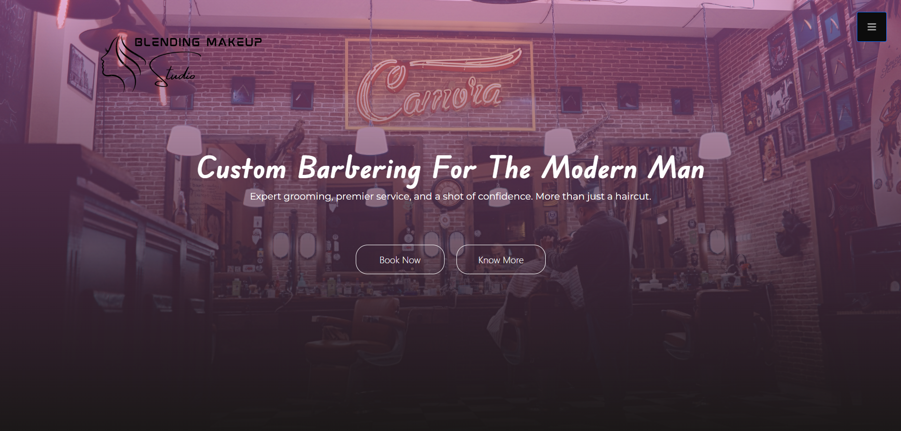

#  Blending Studio

## Description
This project is built using **React.js** and **Node.js** for the backend. It follows the **MVC architecture** and includes CRUD operations that manage data efficiently.

The project is a **frontend-focused** web application, built with **React, HTML5, CSS3,** and **Bootstrap**, features responsive pages and a landing page with a parallax effect for an enhanced user experience. It includes **user authentication**, with Node.js and Express.js handling **registration** and **login**, MongoDB for data storage, and **JWT** for secure access.

## Getting Started

1. **Install dependencies:**

   ```bash
   npm install
2. **Start running:**

   ```bash
   npm start


### 🔗 Backend Repository

👉 [Backend GitHub Repo](https://github.com/harikrishnan2193/Mens-Parlour_Backend)

### 🖼️ Screenshot



### 🚀 Live Demo

[Click here to try the live app](https://mens-parlour-front-end.vercel.app/)

